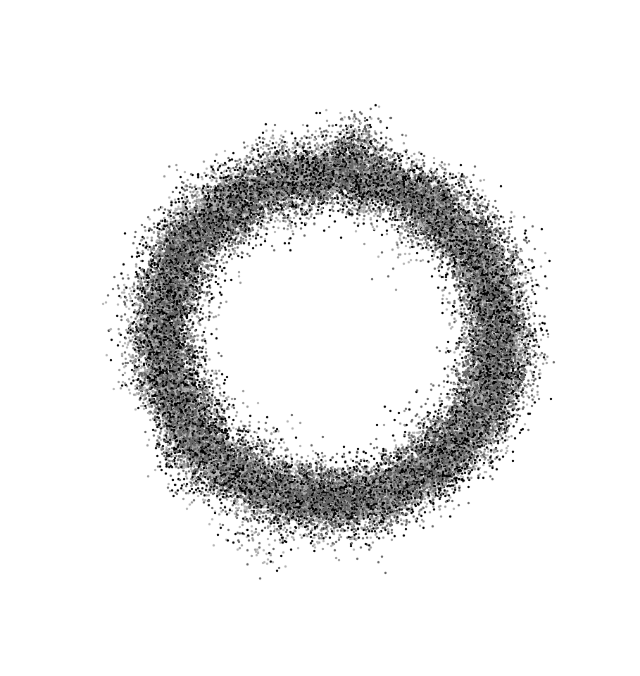

# Diffusion

</img>

Tatsächlich können sich hier Teilchen überlappen, da deren Ausgangpositionen jedoch  auf Linien liegen sind Kollision der Teilchen vernachlässigbar, was das Problem zu einfachen Zufallsbewegungen reduziert.