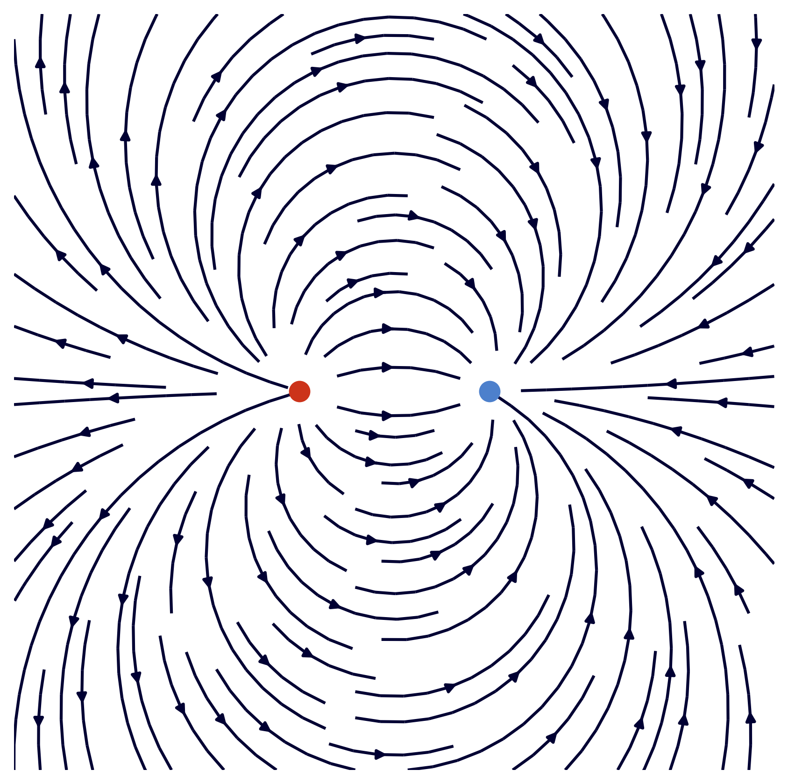

```python
import numpy as np
import matplotlib.pyplot as plt

plt.style.use("default")
plt.style.use("seaborn-dark")
plt.style.use("grayscale")

# Raster
X,Y = np.meshgrid( np.arange(-4,4,.01), np.arange(-4,4,.01) )

# Definition des Feldes im Raster
Ex = (X+1)/((X+1)**2 + Y**2) - (X - 1)/((X-1)**2 + Y**2)
Ey = Y/((X+1)**2 + Y**2) - Y/((X-1)**2 + Y**2)

# Zeige das Feld
fig = plt.figure(figsize=(7,7), dpi=300)
fig.patch.set_facecolor('white')
plt.xticks([])
plt.yticks([])

# Zeige die Ladungen
plt.plot(1, 0, "o",color = (0.3, 0.5, 0.8,1), zorder=60, markersize=10)
plt.plot(-1, 0, "o",color = (0.8,0.2,0.1,1), zorder=60, markersize=10)

# Plotte alles zu zeigende
plt.streamplot(X,Y,Ex,Ey, color = (0,0,0.2,1))
```



