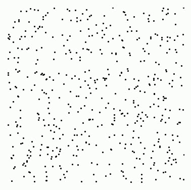

# Gravitation

[Einleitung zur Spiralgalaxie](https://en.wikipedia.org/wiki/Spiral_galaxy)

Ziel dieses kleinen Projektes ist letztendlich eine sehr rudimentäre Simulation der Kollision zweier Galaxien. Hier aber zunächst einfach ein paar erste Tests:

</img>

---

</img>
</img>

---

</img>
</img>
</img>
</img>

Hinweis: Hierbei wurden zeitweise unterschiedliche Parameter, Teilchen und Algorithmen getestet.