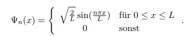
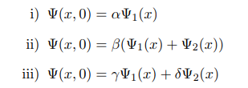
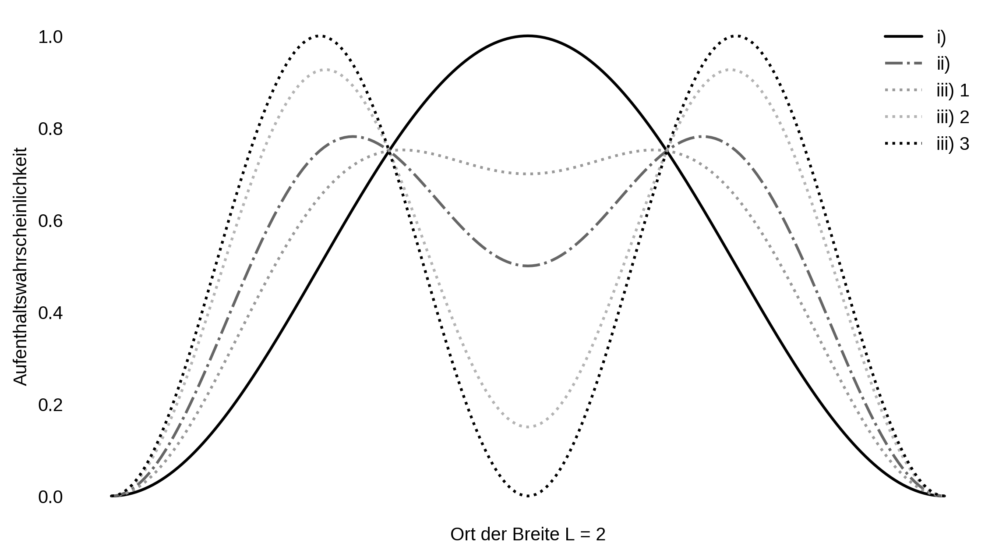

```python
# Module
import math
import matplotlib.pyplot as plt

plt.style.use("default")
plt.style.use("seaborn-dark")
plt.style.use("grayscale")

# Konstanten
x = 0 # Startmesspunkt des Ortes
L = 2 # Breite des Topfes, rechtes Limit des Ortes
m = 1 # Masse
res = 0.01 # Auflösung


# Aufenthaltswahrscheinlichkeit
def W(x,n):
    W= 2/L * math.sin((n * math.pi * x)/L) * math.sin((n * math.pi * x)/L)
    return W

# Datenpunkte
x_point = []
i_point = []
ii_point = []
iii1_point = []
iii2_point = []
iii3_point = []

# Verhältnisauswahl der Konstanten a und b (mit a^2 + b^2 = 1)
a = [0,1,0.5,0.7, 0.15]
b = [1,0,0.5,0.3, 0.85]

while x < (L+res):
    x_point.append(x)
    i_point.append(W(x, 1))
    ii_point.append((W(x,1)+W(x,2))/2)
    iii1_point.append((a[3]*W(x,1))+(b[3]*W(x,2)))
    iii2_point.append((a[4]*W(x,1))+(b[4]*W(x,2)))
    iii3_point.append((a[0]*W(x,1))+(b[0]*W(x,2)))
    x += res
    
# Plot
fig = plt.figure(figsize=(9,5), dpi=300)
fig.patch.set_facecolor('white')

plt.plot(x_point, i_point, label="i)")
plt.plot(x_point, ii_point, "-.", label="ii)")
plt.plot(x_point, iii1_point, ":", label="iii) 1")
plt.plot(x_point, iii2_point, ":", label="iii) 2")
plt.plot(x_point, iii3_point, ":", label="iii) 3")

plt.xlabel('Ort der Breite L = 2')
plt.ylabel('Aufenthaltswahrscheinlichkeit')
plt.xticks([])

#plt.title("Potentialtopf")

plt.legend()

plt.show()
```



