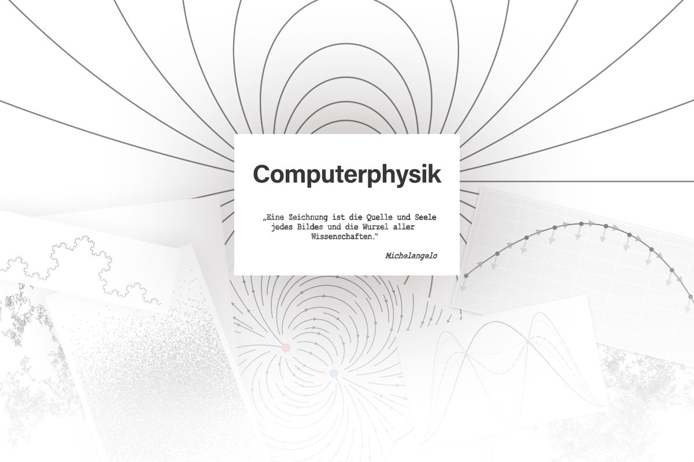

</img>

---
## Computerphysik

Bereits im Grundstudium der Physik finden sich wieder und wieder Probleme, die sich möglicherweise mathematisch leicht lösen lassen, aber dennoch nur schwer vorstellbar sind. Andere Male ist es erst gar nicht möglich analytische Lösungen zu finden und es werden numerisch Näherungen gesucht. Der Computer kann uns die langweiligen Rechenarbeiten abnehmen und uns zeigen, was wir uns vorher nur grob vorstellen konnten. Hier also eine Sammlung verschiedener Skripte der Computerphysik und angrenzender Bereiche, welche nötige Grundlagen bieten.

### Themenübersicht
+ **Visualisieren**
    + Daten und Funktionen
    + Vektoren
    + Vektorfelder
    + 3D-Darstellungen (bald)
    + Animationen
+ **Numerische Standardverfahren**
    + Näherungen von Ableitungen
    + Splineinterpolation (bald)
+ **Numerik gewöhnlicher Differenzialgleichungen**
    + Euler-Verfahren
    + Runge-Kutta Verfahren
    + Mehrschrittverfahren (bald)
+ **Zufall und stochastische Methoden**
    + Verteilungen (bald)
    + Generatoren (bald)
    + Random Walk
    + Monte-Carlo-Integration (bald)
+ **Nichtlineare Dynamik**
    + Chaos
    + Fraktale
+ **Gleichungslöser**
    + Algebra

---

Derzeit komplett in `Python` geschrieben. Um die Skripte lesen und ausführen zu können werden aber außerdem benötigt:
+ `Matplotlib` - Plotmodul
+ `Numpy` - Schnelle Numerik und Array-Operationen
+ `Jupyter Notebook` - Interaktives Programmieren 

### Autor
**Quentin Wach** (https://www.quentin.wach.com) - Ersteller

### Lizens
Das Projekt ist lizensiert unter der MIT-Lizens - sehe die LICENSE.md Datei für mehr.