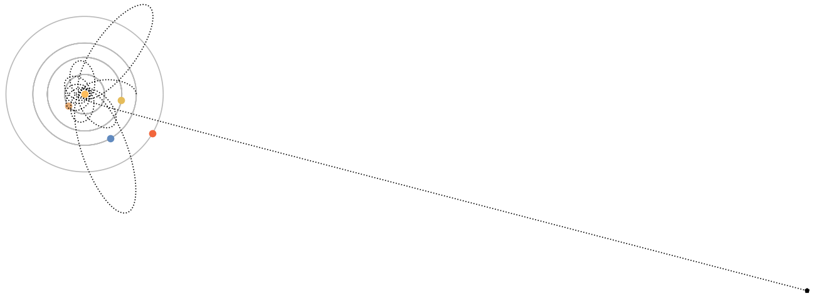

</img>

# Raumschiff im Sonnensystem
    
Es wird ein ballistisches Projektil von der Erde im Sonnensystem abgeschossen.

---

Traditionelle Raumfahrt ist teuer und äußerst Ressourcen-intensiv. Ein einfacherer Weg  ins All zu kommen ist ein sogenannter Skyhook, ein ständig rotierendes Seil, das Raumschiffe wie ein Katapult aus dem Orbit ins All schießt. Aufbauend auf diesem projekt wollen wir eine solche Infrastruktur im Sonnensystem (zunächst zwischen Erde und Mars) simulieren, wobei grundlegende Fragen der Astrodynamik beantwortet werden sollen.
