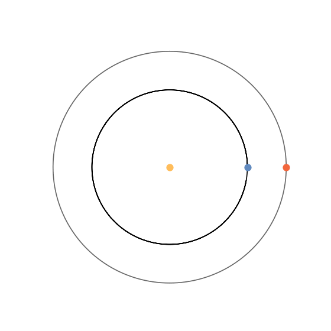

</img>

# Skyhook
    
"Traditionelle Raumfahrt ist teuer, gefährlich und unfassbar Ressourcen-intensiv. Ein einfacherer Weg  ins All zu kommen ist ein sogenannter Skyhook oder Spacetether,  ein ständig rotierendes Seil, das Raumschiffe wie ein Katapult aus dem Orbit ins All schießt." (siehe Video) Wir simulieren eine Skyhook Infrastruktur im Sonnensystem.

---

### Referenzen
+ https://www.youtube.com/watch?v=aoMOSa9kXPw 
+ https://sites.google.com/view/quellenskyhook/

### Setup
Geschrieben in `Python3.5`. Die nötigen Module finden sich in `requirements.txt` und lassen sich über `pip install` in einer virtuellen Umgebung installieren. (Achtung: Derzeit viele überflüssige Module.)

1. Installiere `Python3.5`
2. Installiere `pip`
2. Installiere `virutalenv`
3. Erstelle eine virtuelle Umgebung mit Python3.5 und wähle dieses aus
4. Lade den Projektordner herunter und wählen die dir im Terminal aus
5. Installiere die nötigen Module mit `pip install -r requirements.txt` 
6. Führe das Program mit `python run.py` aus

---

#### TODO  *Deadline: 10. Oktober 2019*
1)  [X] vereinfachte Planetebahnen (Sonne, Erde, Mars)
    1)  [X] Funktion: Planetenbahn
    2)  [X] Planetenklasse
    3)  [X] Planetenbahnen aus Klasse
    4)  [X] Animation der Planetenbewegungen
    5)  [X] Funktion: An/Aus wahre/konstante Skalierung der Radien
    6)  [ ] Plotte Skalen [km] und Zeitleiste [Tage]
2)  [ ] Einfacher Flug Raumschiff RS im Gravitationsfeld der Sonne von Erde zu Mars
    + Flugdauer soll möglichst klein sein
    + geg.: Zeitpunkt bzw. Planetenkonstellation + Abschusszus. (Achtung! Nicht zu hoch! Ausprobieren)
    + Geschwindigkeit soll Fluchtgeschwindigkeit + Abschusszus. entsprechen
3)  [ ] Orbit Raumschiff im Grav der Erde
4)  [ ] Raumschiff --> rotierender Skyhook
5)  [ ] Raumschiff Orbit um Erde mit Skyhook
6)  [ ] Raumschiff von einem Planeten zum nächsten schießen
    + Zielgeschwindigkeit des RS = Geschwindigkeit des Planeten
7)  [ ] Raumschiff mit Skyhook senden und auffangen zwischen Erde und Mars
8)  [ ] Periodischer aumtomatischer Austausch von Raumschiffen zwischen Skyhooks auf versch. Planeten
