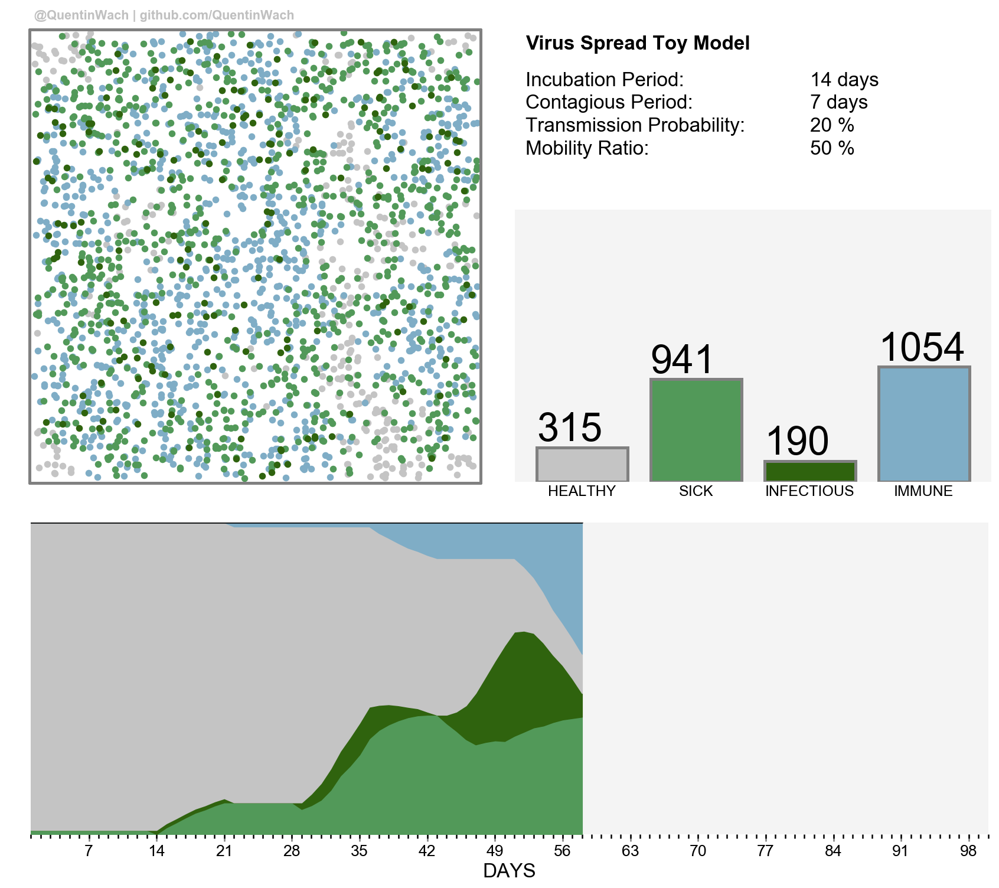

Toysimulation of an Epidemic
============================

</img>

+ The Nodes class holds the properties of the agents in the graph.
+ The Virus class simulates the propagation of the virus in the graph network
of Node objects.
+ The VisualizeVirus class holds methods to create animations and analyse
the simulation of the virus spread.
+ The movie module enables us to combine images from the anim directory and saves a mp4 into the videos directory

